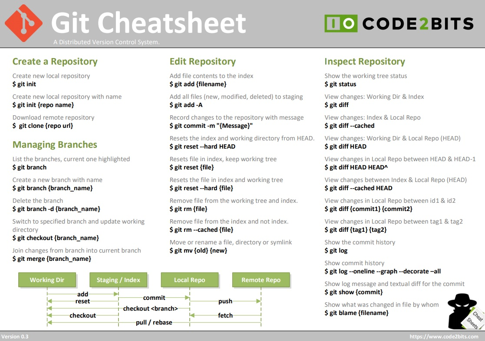
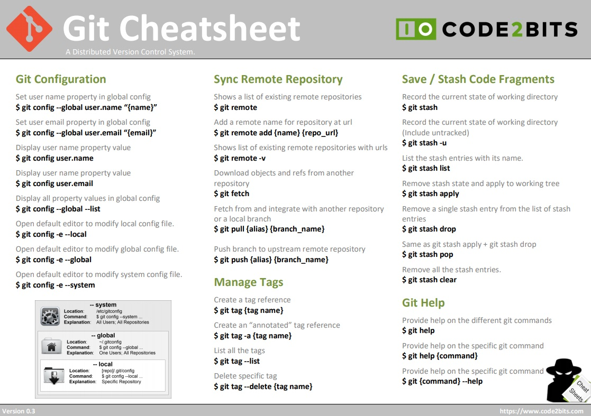
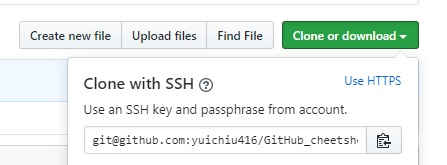
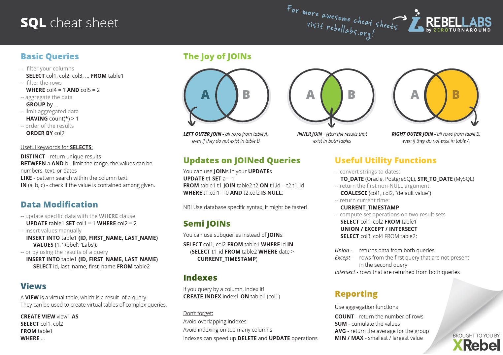

## Create repo steps
### Create an online repo *WITH* a readme file. 

1. Create an online repo **WITH** a readme file. 
2. Create a local directory
3. In the directory, `git init`
4. `git remote add origin <link copied from ssh>`
5. `git pull origin master --rebase`
6. `git branch --set-upstream-to=origin/master master`

**Make sure it's with SSH not with HTTPS**



### Create an online repo *WITHOUT* a readme file. 

1. Create an online repo **WITHOUT** a readme file. 
2. Create a local directory
3. In the directory, `git init`
4. `git remote add origin <link copied from ssh>`
5. `touch readme.md`
6. `git add .`
7. `git commit -m "first commit"`
8. `git push -u origin master`


#### Note1: If you see an error message like:   

`fatal: refusing to merge unrelated histories`

You can try the command `git pull --allow-unrelated-histories`

#### Note2: If you see an error message like: 

```
Warning: Permanently added the RSA host key for IP address 'xxx.xxx.xx.3' to the list of known hosts.
Permission denied (publickey).
fatal: Could not read from remote repository.
Please make sure you have the correct access rights
and the repository exists.
```

It's very likely that you don't have the ssh key set up properly. Please go to [Set up SSH key](#set-up-ssh-key)


### Alternative approach:

1. Create an online repo
2. `git clone <link copied from ssh>`

## How to push

1. `git status` (the step is not required)
2. `git add .`
3. `git commit -m "<commit message>"`
4. `git push `


## Set up SSH key

1. `ssh-keygen -t rsa`, keep hitting enter until the terminal is happy. 
2. Copy the contents of the id_rsa.pub file to your clipboard by typing the following command: <br/>
   on Mac/Linux: `cat < ~/.ssh/id_rsa.pub` | pbcopy<br/>
   on Windows: `clip < %HOMEPATH%\.ssh\id_rsa.pub`<br/>
3. Go to Github->Settings->SSH and GPG keys->New SSH key, save the key you copied from the id_rsa_pub file
 
## Delete a remote branch
`git push origin --delete <branch_name>`

## Create a branch that's tracking the remote one
`git checkout --track origin/<branch_name>`

## Edit last commit message
`git commit --amend`

## Undo last commit
`git reset --soft HEAD~1`

## Reset a single file
`git checkout -- <filename>`

## Update the local list of remote branches
`git remote update origin --prune`

## Compare difference against a remote branch
`git diff <masterbranch_path> <remotebranch_path>`

## Remove all tracked files
`git rm -r --cached .`

## Change defualt editor
`git config --global core.editor "vim"`

## Change terminal color
`git config --global color.ui auto`


## SQL cheetsheet


