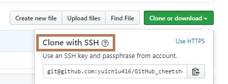

# Create_repo_steps
A cheetsheet with some basic GitHub stuff

1. Create an online repo
2. Create a local directory
3. In the directory, ```git init```
4. ```git remote add origin <link copied from ssh>```





5. ```git pull origin master --rebase```
6. ```git branch --set-upstream-to=origin/master master```


Alternative approach:

1. Create an online repo
2. ```git clone <link copied from ssh>```

# How to push

1. ```git status``` (the step is not required)
2. ```git add .```
3. ```git commit -m "<commit message>"```
4. ```git push ```

# Set up SSH key
1. ```ssh-keygen -t rsa```
2. Go to Github->Settings->SSH and GPG keys->New SSH key
3. Copies the contents of the id_rsa.pub file to your clipboard by typing the following command: <br />
   on Mac/Linux: ```cat < ~/.ssh/id_rsa.pub```<br />
   on Windows: ```clip < %HOMEPATH%\.ssh\id_rsa.pub```<br />
 4. Save
 
 # Remove tracked files
`git rm -r --cached <folder>`
